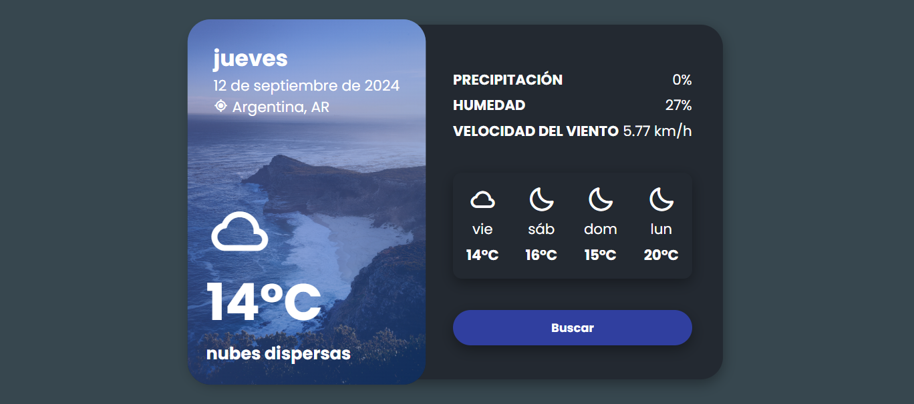

# Aplicación del Tiempo con API

Esta es una aplicación web del tiempo que muestra información meteorológica actual y el pronóstico para los próximos días, utilizando datos obtenidos de la API de OpenWeatherMap. El diseño es responsivo y está construido con HTML, CSS y JavaScript.

## Funcionalidades

- **Clima actual:** Muestra el clima de una ubicación predeterminada (Argentina) con detalles sobre temperatura, descripción del clima, y un ícono dinámico acorde a las condiciones.
- **Búsqueda por ubicación:** Permite buscar el clima de cualquier ciudad introduciendo el nombre de la ubicación deseada.
- **Pronóstico de 4 días:** Muestra el pronóstico del clima para los próximos 4 días, con temperatura y un ícono que representa el clima (soleado, nublado, lluvioso, etc.).
- **Detalles adicionales:** Proporciona datos adicionales como precipitación, humedad, y velocidad del viento.




## Tecnologías Utilizadas

- **HTML5**: Estructura básica de la aplicación.
- **CSS3**: Diseño y estilo de la aplicación, utilizando **Boxicons** para los iconos del clima.
- **JavaScript (ES6)**: Lógica de la aplicación para gestionar las solicitudes a la API y actualizar la interfaz de usuario de manera dinámica.
- **API de OpenWeatherMap**: Proporciona los datos meteorológicos actuales y el pronóstico.

## Instrucciones para Ejecutar el Proyecto

### 1. Clona este repositorio

   Ejecuta el siguiente comando en tu terminal para clonar el repositorio:

```bash
   git clone https://github.com/CRISHFAS/Aplicacion-del-Tiempo-con-API.git
```
2. Ve a [OpenWeatherMap](https://home.openweathermap.org/users/sign_up) y regístrate para obtener una clave API gratuita.


3. Configura la API Key
Abre el archivo index.js y reemplaza la variable apiKey con tu propia clave API:

```javascript
const apiKey = 'TU_API_KEY_AQUI';
```

4. Ejecuta el Proyecto Localmente
Abre el archivo index.html en tu navegador web favorito. Por defecto, se mostrará el clima de Argentina.

5. Buscar otra Ubicación
Haz clic en el botón Buscar.
Ingresa el nombre de la ciudad que deseas consultar.
La aplicación mostrará el clima actual y el pronóstico de los próximos días para la ubicación ingresada.

```graphql
.
├── index.html          # Estructura HTML principal de la aplicación
├── style.css           # Hoja de estilos CSS para la interfaz
├── index.js            # Lógica de la aplicación en JavaScript
└── README.md           # Descripción del proyecto
```

### API Utilizada
Esta aplicación utiliza la API de OpenWeatherMap para obtener los datos meteorológicos. La API proporciona información detallada sobre el clima actual y pronósticos futuros en formato JSON.
[Documentación de la API de OpenWeatherMap](https://openweathermap.org/api)


### Mejoras Futuras

Geolocalización: Implementar la funcionalidad para detectar automáticamente la ubicación del usuario.
Sensación térmica: Añadir información sobre la sensación térmica y otros detalles como la presión atmosférica.
Mejora de diseño móvil: Optimizar el diseño para una mejor experiencia en dispositivos móviles.


